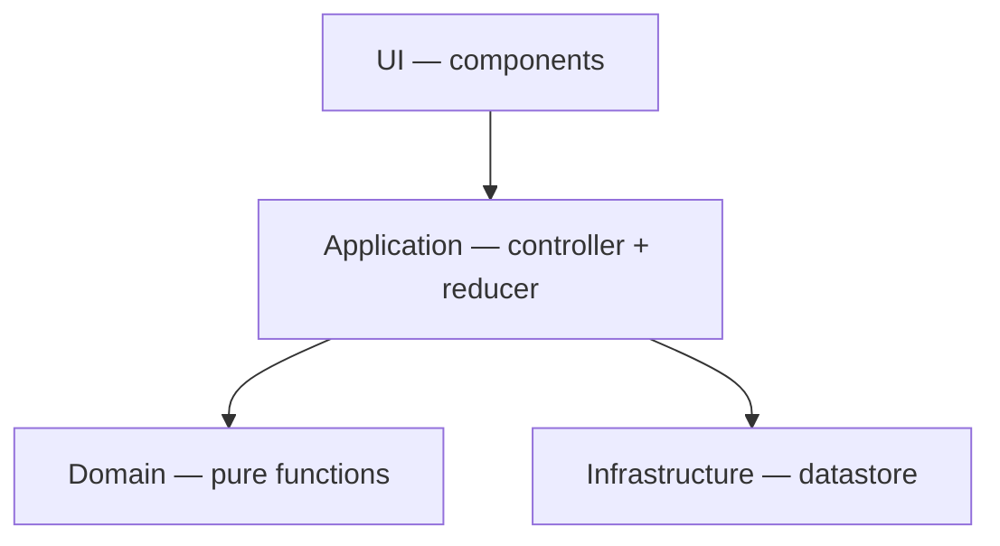

# Architecture

Four layers with unidirectional dependencies. Each layer only imports from the layers below it.



## The layers

**Domain.** Pure functions with no I/O or framework dependencies. Implements the operator catalog, compatibility matrix, filter engine, and value-input-kind dispatch. All functions are total (valid inputs always produce defined outputs).

Domain methods:

- `applyFilter(products, criteria)` → `Product[]` — filters products against a `FilterCriteria`
- `valueInputKindFor(property, operator)` → `ValueInputKind` — tells the UI which input to render
- `parseRawValue(property, operator, raw)` → `ParseResult<CriteriaValue>` — parses a raw string into a typed criteria value
- `isReady(draft)` → `boolean` — checks if a draft has enough data to apply
- `toCriteria(draft)` → `FilterCriteria` — converts a ready draft into filter criteria
- `COMPATIBILITY` — static map of which operators are valid per property type

**Infrastructure.** The bridge between external data sources and the application. Today it holds a single static datastore that exports products and properties. In a production setting, this layer would handle API calls, response mapping, and shape validation — translating external naming conventions into the domain's types so no other layer knows a translation occurred.

**Application.** A `useReducer`-based controller that holds the in-progress filter draft as primary state. Exposes mutation operations (`selectProperty`, `selectOperator`, `setValue`, `clear`) and derives everything else — available operators, value input kind, filtered products, parse errors — from the draft. No duplicated state.

**UI.** Stateless components rendered from props. The only local state lives inside value input components (raw text before commit). The controller drives what renders: which inputs appear, which operators are available, which products are shown. Tailwind and Shadcn take the place of a theoretical design system.

## Key structures

### FilterDraft state machine

The in-progress filter is a discriminated union with four states. The `stage` field determines which fields are present.

```mermaid
stateDiagram-v2
    [*] --> needs-property
    needs-property --> needs-operator : selectProperty
    needs-operator --> needs-value : selectOperator
    needs-operator --> ready : selectOperator (any/none)
    needs-value --> ready : setValue (valid)
    needs-value --> needs-value : setValue (invalid → parseError)
    ready --> ready : setValue (update)

    needs-operator --> needs-operator : selectProperty (reset)
    needs-value --> needs-operator : selectProperty (reset)
    ready --> needs-operator : selectProperty (reset)
    needs-value --> needs-value : selectOperator (reset value)
    ready --> needs-value : selectOperator (reset value)

    ready --> needs-property : clear
    needs-value --> needs-property : clear
    needs-operator --> needs-property : clear
```

Each user action advances or resets the machine. Changing the property resets to `needs-operator`; changing the operator resets to `needs-value` (or jumps straight to `ready` for valueless operators like `any`/`none`). Clear always returns to the initial state.

### Value input dispatch

`valueInputKindFor(property, operator)` returns one of 7 kinds: `none`, `text`, `number`, `multi-text`, `multi-number`, `enum-single`, `enum-multi`. A single `<ValueInput>` dispatcher component maps the kind to the corresponding subcomponent. The dispatcher is keyed on the selected operator so React remounts the input (and resets local state) when the operator changes.

### Derived state

Available operators, value input kind, filtered products, and parse errors are all computed from the primary filter draft. They are not stored separately.

### FilterCriteria

Discriminated union with `kind: 'none'` (no filter) and `kind: 'single'` (one active filter). Extensible to compound filters via new variants without changing existing switch branches.

## Folder structure

```
src/
  domain/           # Pure functions: types, operators, compatibility, filter, valueInput
  infrastructure/   # Data access: static datastore (would hold API clients in production)
  application/      # State management: filterReducer + useFilterController hook
  components/       # React components: FilterBar, ValueInput dispatcher + 6 inputs,
                    #   PropertySelect, OperatorSelect, ProductTable, ClearButton, layout
  components/ui/    # shadcn primitives: tooltip, button, icons
```

Each layer has co-located `__tests__/` directories.

## Dependencies and frameworks

- **React + Vite + TypeScript** — standard SPA toolchain
- **Tailwind + shadcn (v4, Base UI)** — design system stand-in; provides consistent styling without custom CSS
- **Vitest** — unit tests, jsdom scoped per component test file (not global, to avoid memory overhead)
- **Playwright** — E2E tests against the dev server
