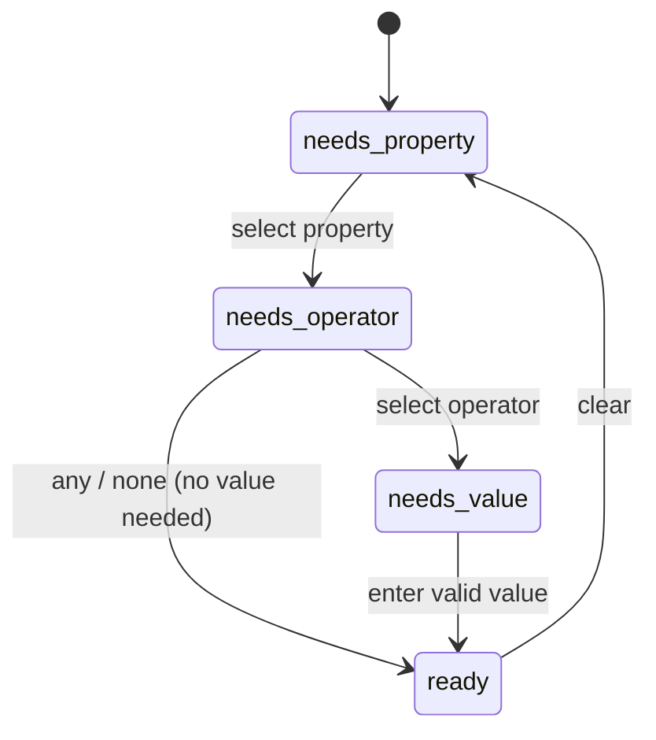
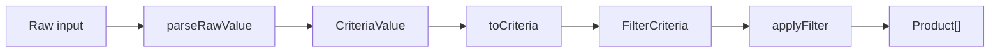

# Domain

The domain is the rules of the problem, expressed as data and pure functions. No I/O, no DOM, no framework imports. Every function is total — given valid inputs, always a defined output.





## Types

### Product

```ts
interface Product {
    id: number;
    propertyValues: PropertyValue[];
}
```

A product need not have a value for every property. The sample data demonstrates this: products 3–5 lack an entry for the `wireless` property. Operators that test for presence (`any`, `none`) and operators requiring a value (`equals`, `greater_than`, etc.) must both handle this absence.

### Property

```ts
type PropertyType = 'string' | 'number' | 'enumerated';

interface Property {
    id: number;
    name: string;
    type: PropertyType;
    values?: string[]; // present only when type === 'enumerated'
}
```

The `values` field is the closed set of allowed values for enumerated properties. Required for `'enumerated'`, absent otherwise.

### PropertyValue

```ts
interface PropertyValue {
    propertyId: number;
    value: string | number;
}
```

Field names use the domain's camelCase convention. The data layer handles any mapping from external formats.

### Operator

```ts
type OperatorId = 'equals' | 'greater_than' | 'less_than' | 'any' | 'none' | 'in' | 'contains';

interface Operator {
    id: OperatorId;
    text: string;
}
```

| Operator       | Reads          | Semantics                                               |
| -------------- | -------------- | ------------------------------------------------------- |
| `equals`       | one value      | product's value exactly equals candidate                |
| `greater_than` | one value      | product's numeric value strictly greater than candidate |
| `less_than`    | one value      | product's numeric value strictly less than candidate    |
| `any`          | nothing        | product has a value for the property                    |
| `none`         | nothing        | product has no value for the property                   |
| `in`           | list of values | product's value equals any candidate in the list        |
| `contains`     | one value      | product's string value contains candidate as substring  |

Equality and substring semantics (case sensitivity, whitespace) are decided in `assumptions.md`.

## Compatibility map

```ts
const COMPATIBILITY: Record<PropertyType, OperatorId[]> = {
    string: ['equals', 'any', 'none', 'in', 'contains'],
    number: ['equals', 'greater_than', 'less_than', 'any', 'none', 'in'],
    enumerated: ['equals', 'any', 'none', 'in'],
};
```

## ValueInputKind

The domain tells the View _what kind of input_ to render. The View dispatches on the kind — it never branches on property type or operator id.

```ts
type ValueInputKind =
    | 'none' // any, none
    | 'text' // string equals/contains
    | 'number' // number equals/greater_than/less_than
    | 'multi-text' // string in
    | 'multi-number' // number in
    | 'enum-single' // enumerated equals
    | 'enum-multi'; // enumerated in
```

Examples:

- `valueInputKindFor(string, contains)` → `'text'`
- `valueInputKindFor(number, greater_than)` → `'number'`
- `valueInputKindFor(number, in)` → `'multi-number'`
- `valueInputKindFor(enumerated, in)` → `'enum-multi'`
- `valueInputKindFor(string, any)` → `'none'`

## CriteriaValue

The parsed, ready-to-apply value. Discriminated by the same `kind` as `ValueInputKind`:

```ts
type CriteriaValue =
    | { kind: 'none' }
    | { kind: 'text'; value: string }
    | { kind: 'number'; value: number }
    | { kind: 'multi-text'; values: string[] }
    | { kind: 'multi-number'; values: number[] }
    | { kind: 'enum-single'; value: string }
    | { kind: 'enum-multi'; values: string[] };
```

`ValueInputKind` and `CriteriaValue` share the same `kind` tags by design — a common vocabulary so the View, controller, and domain agree on what shape of data is in play. But they serve different roles and are kept separate because they sit at different stages of the pipeline:

- **`ValueInputKind`** is a rendering instruction — a plain string. The View reads it, picks the right input component. No data attached, no business logic.
- **`CriteriaValue`** is the parsed payload — the same kind plus actual validated data. This is what `parseRawValue` produces and what `applyFilter` consumes.

They are structurally identical today. Keeping them separate leaves room for divergence: a hypothetical "date-range" operator could render two datepickers (`'date-range'` as a `ValueInputKind`) but produce one `{ start, end }` payload (a single `CriteriaValue` variant). If divergence never happens, a future maintainer can merge them. For now the cost is low and the seam costs nothing to keep.

## FilterCriteria

Tagged union consistent with the rest of the domain. A future compound-filter variant (`{ kind: 'compound'; combinator: 'and' | 'or'; children: FilterCriteria[] }`) extends without changing existing branches.

```ts
type FilterCriteria =
    | { kind: 'none' }
    | { kind: 'single'; propertyId: number; operatorId: OperatorId; value: CriteriaValue };
```

## FilterDraft

The in-progress filter. Modeled as a discriminated union — impossible states cannot be represented. The discriminator is `stage` (rather than `kind`) so it doesn't collide visually with `CriteriaValue.kind` when the two appear nested.

```ts
type FilterDraft =
    | { stage: 'needs-property' }
    | { stage: 'needs-operator'; propertyId: number }
    | { stage: 'needs-value'; propertyId: number; operatorId: OperatorId }
    | { stage: 'ready'; propertyId: number; operatorId: OperatorId; value: CriteriaValue };
```

Each `stage` names what the draft is waiting on next, so the View can dispatch on it directly. Only a `'ready'` draft can be applied. Operators that take no value (`any`, `none`) reach `'ready'` as soon as the operator is selected, with `value: { kind: 'none' }`.

## ParseResult

Raw user input parsing can fail. The domain returns a tagged result — this is ordinary state, not an exception.

```ts
type ParseResult<T> = { ok: true; value: T } | { ok: false; error: string };
```
