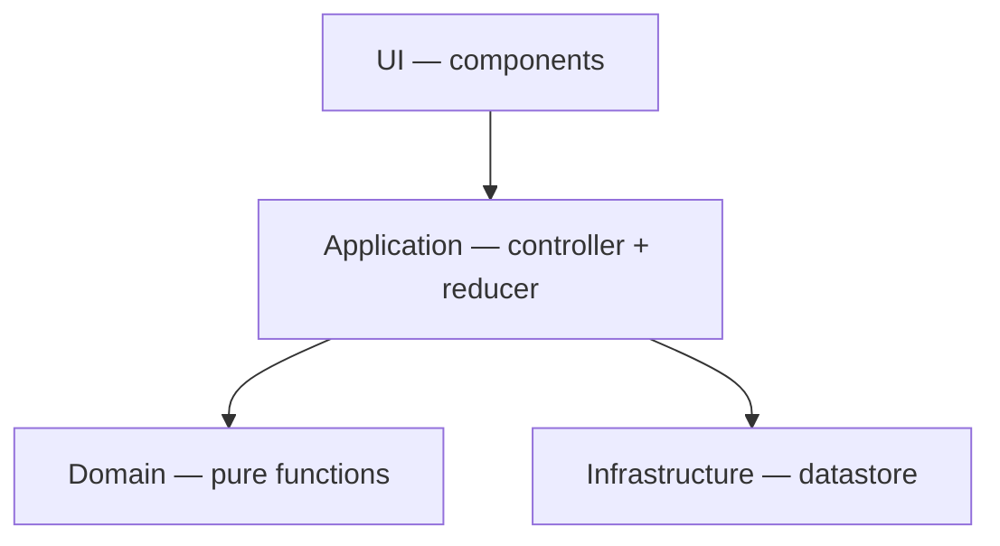

# Product Filter

A condition editor for filtering products by property, operator, and value. Built with React, TypeScript, Vite, and Tailwind/shadcn.

[Live App](https://thaenor.github.io/salsify-condition-filter-UI/) | [Lighthouse Report](https://thaenor.github.io/salsify-condition-filter-UI/lighthouse/)

## Quick Start

```bash
npm install
npm run dev           # starts dev server at localhost:5173
npm run check         # runs tsc + vitest + eslint + prettier
npx playwright install  # one-time browser setup for E2E
npm run test:e2e      # runs Playwright E2E tests
```

## Architecture

Four layers with unidirectional dependencies — each layer only imports from the layers below it.



- **Domain** — pure functions with no framework dependencies. Operator catalog, compatibility matrix, filter engine, value parsing. Testable without React or a DOM.
- **Infrastructure** — data access. Today a static datastore; in production this would handle API calls and response mapping.
- **Application** — a `useReducer`-based controller that holds the filter draft as a state machine, derives everything else (available operators, input kind, filtered products, parse errors).
- **UI** — stateless components rendered from props. A `ValueInput` dispatcher maps 7 input kinds to subcomponents.

See [Docs/01_architecture.md](Docs/01_architecture.md) for the full breakdown including the state machine diagram, value dispatch pipeline, and folder structure.

## Design Decisions

### The filter draft is a state machine, not loose state

The in-progress filter is modeled as a discriminated union with four stages: `needs-property → needs-operator → needs-value → ready`. Each stage determines which fields exist — you literally cannot access an operator before a property is selected, because the type doesn't have that field yet.

This was a deliberate choice over the simpler approach of four separate `useState` calls. With separate state, nothing prevents an operator from existing without a property, or a value without an operator. The state machine makes impossible states unrepresentable at the type level, not just at runtime. Every transition is an explicit case in the reducer, which makes the logic easy to test and straightforward to extend.

### Domain-first, framework-free

The domain layer has zero React imports. It's pure functions and typed data: `applyFilter`, `parseRawValue`, `valueInputKindFor`, the compatibility matrix. All business rules live here and nowhere else.

This means the domain can be tested without jsdom, without rendering components, without simulating user events — the test suite runs in milliseconds. It also means the rules are portable. If the UI framework changed, the domain wouldn't.

The tradeoff is an extra layer of indirection. The controller translates between the domain's vocabulary and React's world. For this scope that's a net positive — the controller is thin and the domain is independently verifiable.

## Testing

Tests were written alongside implementation for every layer. Domain logic tested as pure functions, the reducer tested as a state machine, components tested in isolation with Testing Library, and full user flows covered by Playwright E2E tests.

See [Docs/04_tests.md](Docs/04_tests.md) for the testing strategy and structure.

## Assumptions

The problem statement leaves several behaviors unspecified — case sensitivity, whitespace handling, presence semantics, number parsing rules. Each is documented with the decision made and the reasoning behind it.

See [Docs/00_assumptions.md](Docs/00_assumptions.md) for the full list.

## Development Process

Started with the domain layer — types, operators, compatibility matrix, filter engine — before writing any React. This established the vocabulary and rules that everything else builds on. Tests came first or alongside each module.

From there: infrastructure (datastore), application (reducer + controller hook), then UI components one at a time. Each input variant was built as its own component with its own tests, then wired through the `ValueInput` dispatcher.

Accessibility, error display, and E2E tests came last as polish passes. CI was added via GitHub Actions to run the full quality gate on every push.

Total time: ~15 hours spread across a few days.

## Known limitations

- The active filter lives in memory only — refreshing the page loses it. URL-encoding the filter state would fix this.
- `operators`, `COMPATIBILITY`, and `VALUE_INPUT_MAP` are three separate static maps that must stay in sync manually. A consistency test would catch drift, but there isn't one yet.
- Accessibility is a manual baseline. Integrating axe-core into Playwright would catch regressions automatically.

## Documentation

Detailed docs live in `Docs/`:

- [Architecture](Docs/01_architecture.md) — layers, state machine, folder structure
- [Domain](Docs/02_domain.md) — types, operators, compatibility, value dispatch
- [Conventions](Docs/03_conventions.md) — naming, exports, code style, error handling
- [Tests](Docs/04_tests.md) — testing strategy and structure
- [Accessibility](Docs/05_accessibility.md) — a11y improvements and what's covered
- [Assumptions](Docs/00_assumptions.md) — ambiguous requirements and decisions made
